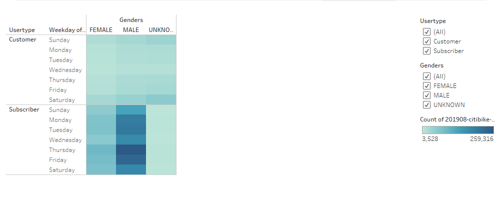

[link to dashboard](https://public.tableau.com/app/profile/hunter.valentine)
# Bikesharing

## Overview of Project
In this project, we are looking at bike sharing data from Citibike. We are tasked with creating visualizations to portray how often the bikes are used as well as various other things.

## Results

- The average checkout time looks to be around 10 minutes with a steep decline after that.

- With orange being unknown, it does appear that more men ride bikes than women, and every graph follows roughly the same shape (No change in checkout variation based on Gender).

- The peak ride times appear during rush hour (7-8 AM and 5-6 PM).

- Men and women look to follow similar bike ride times, with the women graph being more faded because there is less women who ride bikes.

- A large majority of the riders appear to be subscribers versus normal customers.

- A large majority of the start locations are in lower and mid Manhattan.

- Similar to above, the ending locations are much bigger in the Manhattan area.

## Summary
With all these visualizations, we can look at a few things in specific. The maps help to provide us locations where the bikes are most commonly used. Increasing the number of bikes at these locations could increase profits. The heat charts assist in a significant way. With bikes and stations, repairs will always be needed. We can look at the hours when the bikes are least used, and use these hours for maintenance and repair. The line graphs go to show that the users tend to ride the bikes for 10-20 minutes on average. This could be mainly for commuting purposes. 

I would recommend two additional visualizations that could be created: 
1. A visualization showing customer starting and ending locations versus subscribers starting and ending location. This could go to show if subscribers tend to be people commuting to similar locations.
2. A visualization on bike id average ride time. An extremely short average ride time could go to show that people checked a bike out, it was broken, and cancelled their trip. This could go to show bikes that need immediate repairs.
